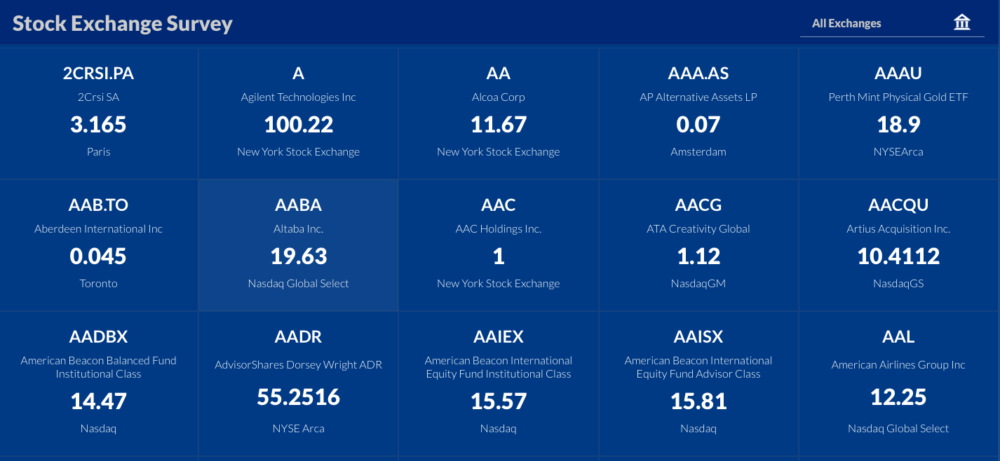
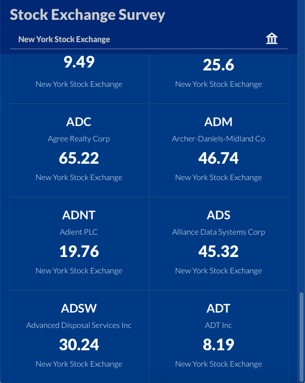
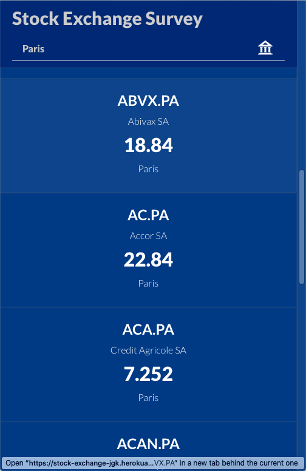
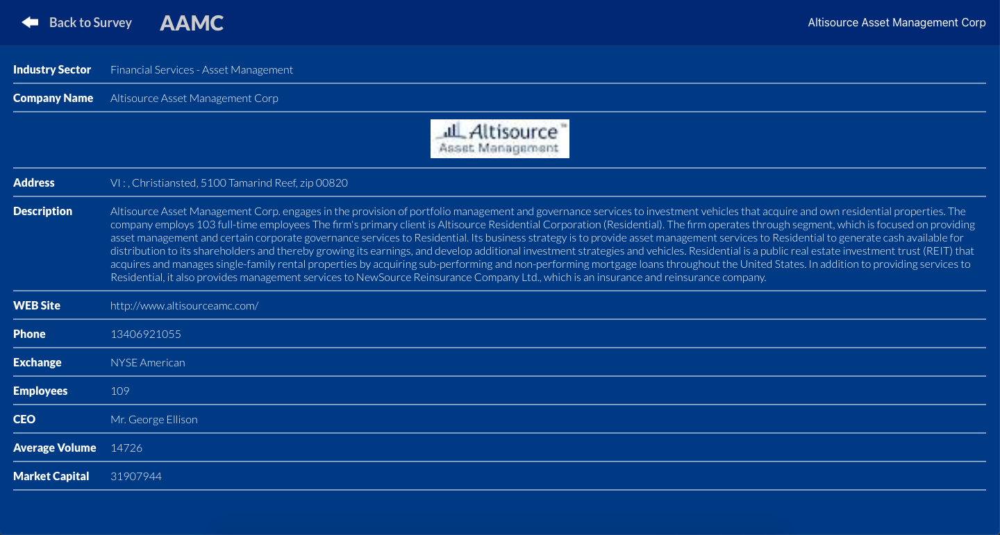
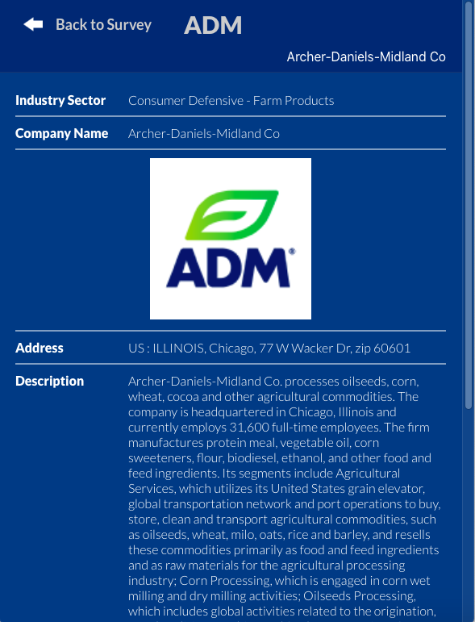

# Stock Exchange Survey

<!--
*** Thanks for checking out this README Template. If you have a suggestion that would
*** make this better, please fork the repo and create a pull request or simply open
*** an issue with the tag "enhancement".
*** Thanks again! Now go create something AMAZING! :D
-->

<!-- PROJECT SHIELDS -->
<!--
*** I'm using markdown "reference style" links for readability.
*** Reference links are enclosed in brackets [ ] instead of parentheses ( ).
*** See the bottom of this document for the declaration of the reference variables
*** for contributors-url, forks-url, etc. This is an optional, concise syntax you may use.
*** https://www.markdownguide.org/basic-syntax/#reference-style-links
-->

[![Contributors][contributors-shield]][contributors-url]
[![Forks][forks-shield]][forks-url]
[![Stargazers][stars-shield]][stars-url]
[![Issues][issues-shield]][issues-url]

<!-- PROJECT LOGO -->
<br />
<p align="center">
  <a href="https://github.com/ioanniskousis/stock-exchange">
    
  </a>
  
  <h3 align="center">The Stock Exchange Survey Application</h3>
  
  <p align="center">
    This project is part of the Microverse curriculum in React/Redux course
    <br />
    <a href="https://github.com/ioanniskousis/stock-exchange"><strong>Explore the docs</strong></a>
    <br />
    <a href="https://stock-exchange-jgk.herokuapp.com">Live Demo On Heroku</a>
    <br />
    <a href="https://www.loom.com/share/c0904f53e7ed4176a39029d0bba58339">Video Presentaion on Loom</a>
    <br />
    <a href="https://github.com/ioanniskousis/stock-exchange/issues">Report Bug</a>
    <span> - </span>
    <a href="https://github.com/ioanniskousis/stock-exchange/issues">Request Feature</a>
  </p>
</p>

### This is a demonstration of Stock Exchange information system, providing a list of instruments and an instrument's profile view. It connects to the **Financial Modeling Prep API**  to download data

<hr />

<!-- TABLE OF CONTENTS -->

## Table of Contents

- [Screen Shots](#screen-shots)
- [About the Project](#about-the-project)
- [Application Instructions](#application-instructions)
- [Live Version](#live-version)
- [System Requierments](#system-requierments)
- [Development](#development)
- [Dependencies](#dependencies)
- [Built With](#built-with)
- [Contributors](#contributors)
- [Acknowledgements](#acknowledgements)

## Screen Shots

### Instruments List



<hr />

### Instrument Profile


<hr />

<!-- ABOUT THE PROJECT -->

## About The Project

The project was created using the create-react-app model  
It is a Single Page Application using JavaScript functionality to show subpages   
The entry point leads to the Symbols List where available symbols are shown including company name, the last closing price and the Stock Exchange where the symbol is traded  
Symbols can be filtered by their container Stock Exchange using the filter selection at the top-right  
Clicking a symbol panel shows the Symbol Profile page where all available information about the selected symbol is shown in a table view  

The project files tree:

```
-src  
  -actions  
    actionsIndex.js  
  -api
    instruments.js  
    profile.js  
  -components  
    App.js  
  -containers  
    instrumentPanel.js  
    instrumentProfile.js  
    instrumentProfileHeader.js  
    instrumentsList.js  
    instrumentsListHeader.js  
  -reducers  
    instrumentsReducer.js  
    reducersIndex.js  
  index.js  
  utils.js  
```
  - The entry point is root **scr/index.js** where the **App** component is rendered through the **Provider** components of Redux. 
  - Actions **initInstruments**, **changeFilter**, **showProfile**, and **showList** are in **actions/actionsIndex.js**  
  - Componet **App** is held in respective file in **components/** folder  
  - Reducers are in **reducers/** folder, currently only 1, the **instrumentsReducer** in reducers/instrumentsReducer.js is combined into **reducersIndex** held in reducers/reducersIndex.js  
  - The **App** component renders either 
    - **InstrumentsListHeader** and **InstrumentsList**  
    or  
    - **InstrumentProfileHeader** and **InstrumentProfile**  
    components depending on selection between the index of symbols or a symbols's profile
  - The **InstrumentsListHeader** component renders the header for the **Symbols List**, and filters symbols on selected Stock Exchage  
  - The **InstrumentsList** renders the **Symbols List**  
  - The **InstrumentProfileHeader** component renders the header for the **InstrumentProfile**  
  - The **InstrumentProfile** renders all available information about an instrument  

#### Please note that the number of downloaded symbols by the API is 14000+, so I limited this by slicing the array on the first 200 symbols
<hr/>

<!-- ABOUT THE PROJECT -->

## Application Instructions
  In the entry page, select a Stock Exchange at the top-right to filter symbols or let All Exchanges to show all symbols  
  Click a symbol's panel to show Symbol's Profile page  

<hr/>

## Live Version

### [Live Demo On Heroku](https://stock-exchange-jgk.herokuapp.com)
### [Video Presentaion](https://www.loom.com/share/c0904f53e7ed4176a39029d0bba58339)
<hr/>

## System Requierments

- JavaScript Enabled
- You need to Disable Cross-Origin-Restrictions from your browser if you want to open the index.html from your file system without using a server.

<hr/>

## Development

- Clone the project

```
  https://github.com/ioanniskousis/stock-exchange.git

  Use VSCode and Live Server to show index.html
  Since webpack is used, run 'npm run build' on you terminal before opening  
  run : npm start to open the project using localhost:3000  
```

<hr/>

## Dependencies

please run

```
  npm run build
```

to comply with the dependencies held in package.json

<hr/>

## Built With

This project was built using these technologies.

- React
- Redux
- API (Financial Modeling Prep)
- CSS3
- webpack
- Git - GitHub
- ESLint
- Stylelint
- heroku

<hr/>

<!-- CONTACT -->

## Contributors

:bust_in_silhouette:
## Ioannis Kousis

- Github: [@ioanniskousis](https://github.com/ioanniskousis)
- Twitter: [@ioanniskousis](https://twitter.com/ioanniskousis)
- Linkedin: [Ioannis Kousis](https://www.linkedin.com/in/jgkousis)
- E-mail: jgkousis@gmail.com
​
<hr/>
<!-- ACKNOWLEDGEMENTS -->

## Acknowledgements

- [Microverse](https://www.microverse.org/)
- [Thanks to **Nelson Sakwa on Behance** for their design inspiration](https://www.behance.net/sakwadesignstudio)

<!-- MARKDOWN LINKS & IMAGES -->
<!-- https://www.markdownguide.org/basic-syntax/#reference-style-links -->

[contributors-shield]: https://img.shields.io/github/contributors/ioanniskousis/stock-exchange.svg?style=flat-square
[contributors-url]: https://github.com/ioanniskousis/stock-exchange/graphs/contributors
[forks-shield]: https://img.shields.io/github/forks/ioanniskousis/stock-exchange.svg?style=flat-square
[forks-url]: https://github.com/ioanniskousis/stock-exchange/network/members
[stars-shield]: https://img.shields.io/github/stars/ioanniskousis/stock-exchange.svg?style=flat-square
[stars-url]: https://github.com/ioanniskousis/stock-exchange/stargazers
[issues-shield]: https://img.shields.io/github/issues/ioanniskousis/stock-exchange.svg?style=flat-square
[issues-url]: https://github.com/ioanniskousis/stock-exchange/issues
